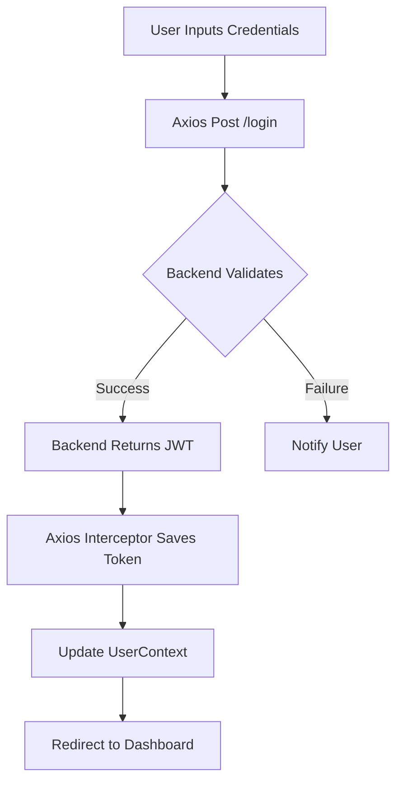

# Corporate JWT-Auth RBAC Frontend

[]()
[](https://opensource.org/licenses/MIT)

A robust, enterprise-ready administrative dashboard for managing users, roles, and group permissions through a secure JSON Web Token (JWT) infrastructure.

---

## Table of Contents

- [Overview](#overview)
- [Key Features](#key-features)
- [Technology Stack](#technology-stack)
- [Architecture & Flow](#architecture--flow)
- [Getting Started](#getting-started)
  - [Prerequisites](#prerequisites)
  - [Installation](#installation)
  - [Configuration](#configuration)
- [Project Structure](#project-structure)
- [Security & Authentication](#security--authentication)
- [Scripts](#scripts)
- [License](#license)

---

## Overview

This application serves as the frontend for a sophisticated identity management system. It enables administrators to perform granular Role-Based Access Control (RBAC) operations while ensuring secure session management via JWT. Built with performance and scalability in mind, it utilizes React's Context API for global state and Axios for interceptor-based API communication.

## Key Features

*   **Advanced RBAC Management:** Granular control over users, individual roles, and role groups.
*   **Secure Authentication:** Complete Login and Registration flows with persistent session handling.
*   **Dynamic Routing:** Integrated private route protection based on authentication and authorization states.
*   **Data Pagination:** High-performance user listing with server-side pagination support.
*   **Toast Notifications:** Real-time feedback for all CRUD operations using `react-toastify`.
*   **Responsive Design:** Mobile-first approach using React-Bootstrap.
*   **Axios Middleware:** Automated handling of token attachment and error response normalization via interceptors.

## Technology Stack

| Category | Technology |
| :--- | :--- |
| **Core Framework** | React 17 |
| **Routing** | React Router v5 |
| **State Management** | React Context API |
| **Styling** | Bootstrap 5, SCSS, Font Awesome |
| **API Client** | Axios |
| **Form Utilities** | Lodash, UUID |
| **UI Components** | React-Bootstrap, React Paginate, React Loader Spinner |

## Architecture & Flow

### Authentication Logic


## Getting Started

### Prerequisites

*   **Node.js**: v14.0.0+
*   **npm**: v6.0.0+

### Installation

1. Clone the repository:
   ```bash
   git clone <repository-url>
   cd jwt-frontend-react
   ```

2. Install dependencies:
   ```bash
   npm install
   ```

### Configuration

Create a `.env` file in the root directory based on `.env.example`:

```bash
REACT_APP_BACKEND_URL=http://localhost:8080/api/v1
```

## Project Structure

```text
src/
├── components/       # Feature-based UI components (Login, Users, etc.)
├── context/          # Global state management using Context API
├── image/            # Static assets and images
├── routes/           # Routing logic and route protection components
├── services/         # API abstraction layer (Axios services)
├── setup/            # Axial interceptors and global configurations
├── App.js            # Main application component & routes entry
└── index.js          # Entry point of the React application
```

## Security & Authentication

*   **JWT Persistence:** Tokens are securely handled via HTTP-only cookies (recommended backend implementation) or automated Axios state.
*   **Interceptors:** All outgoing requests are intercepted to check for session validity, and incoming responses (401/403) trigger automated logout or refresh flows.
*   **Private Routes:** Access to administrative pages is guarded by the `<PrivateRoutes />` component, ensuring unauthorized users are redirected.

## Scripts

*   `npm start`: Runs the app in development mode at `http://localhost:3000`.
*   `npm run build`: Compiles the application for production in the `build/` folder.
*   `npm test`: Launches the interactive test runner.

## License

Distributed under the MIT License. See `LICENSE` for more information.

---
© 2026 JWT RBAC Project. All rights reserved.
